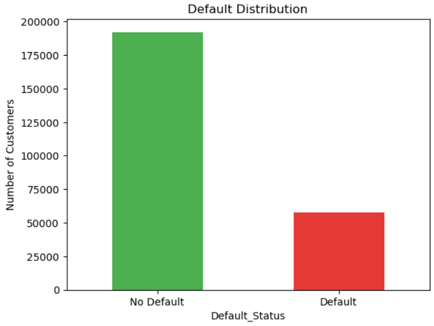
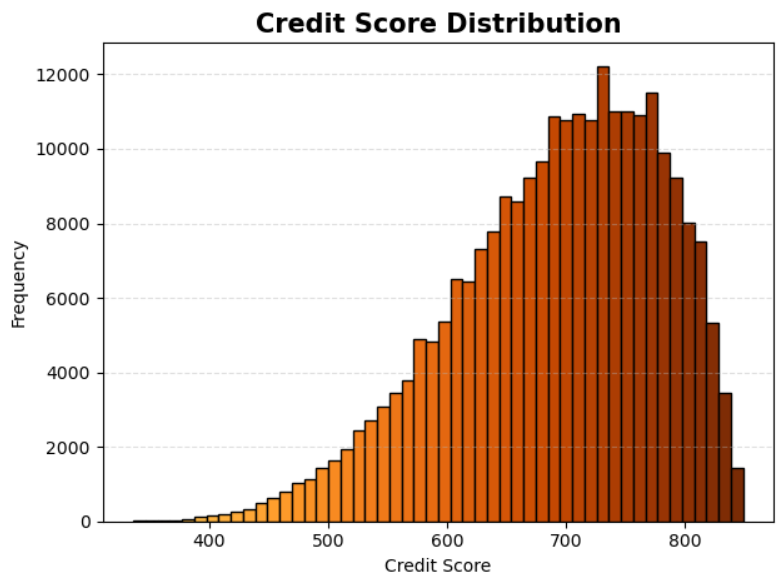
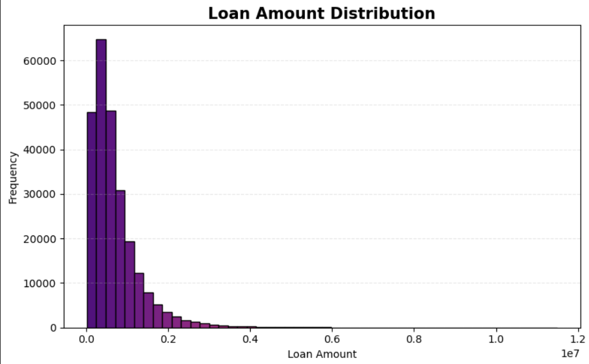
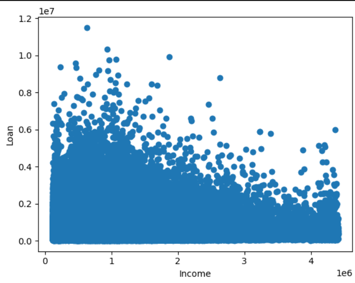

# 🏦 Enterprise Loan Default Risk Prediction using Machine Learning & Explainable AI

An end-to-end Credit Risk Analytics project that predicts loan defaults using Machine Learning, Explainable AI (SHAP), SQL, and Power BI to support transparent, data-driven lending decisions.

## 🚀 Project Overview

Loan defaults represent one of the biggest financial risks for banks and lending institutions. Traditional credit scoring methods often fail to capture customer behavior and financial stress, leading to inaccurate risk assessments.

This project develops a complete Loan Default Prediction & Credit Risk Analytics System by integrating:

 * Machine Learning
 * Explainable AI (SHAP)
 * SQL
 * Exploratory Data Analysis (EDA)
 * Interactive Power BI Dashboards

 The solution combines customer demographics, financial information, credit history, loan characteristics, and behavioral transaction features to predict default risk while providing transparent business insights for decision-makers.

---

# 🎯 Business Objective

 The primary objective of this project is to help financial institutions:

* Identify high-risk borrowers before loan approval
* Improve loan approval decisions using predictive analytics
* Understand the major drivers of customer default
* Enable explainable lending decisions using SHAP
* Support business teams through interactive dashboards

---

## Also Presented Through Visualizations ->







# 📂 Dataset Description

The project is built on a realistic synthetic banking dataset designed to simulate enterprise lending scenarios.

### Customer Profile

Contains:

 * CustomerID
 * Age
 * Gender
 * Marital Status
 * Education Level
 * Employment Status
 * Income Details

### Credit Profile

Contains:

 * Credit Score
 * Credit Utilization Ratio
 * Previous Defaults
 * Delinquencies
 * Active Loans
 * Average Days Past Due

### Loan Information

Contains:

 * Loan Amount
 * Loan Purpose
 * Interest Rate
 * Loan Term
 * EMI
 * Application Channel

### Transaction History

Contains:

 * Salary Credits
 * Rent Payments
 * Shopping
 * Utilities
 * Dining
 * Travel
 * Account Balance
 * Transaction Amount
 * Transaction Date

### Risk Analysis

Contains:

 * Debt-to-Income Ratio
 * Loan-to-Income Ratio
 * EMI-to-Income Ratio
 * Behavioural Risk Score
 * High Risk Flag
 * Default Status

 ---
 
# 🛠 Tech Stack

## Programming Language
 
 * Python

## Database

 * SQLite
 * SQL

## Python Libraries
 * Pandas
 * NumPy
 * Matplotlib
 * Seaborn
 * Scikit-learn
 * SHAP
 * XGBoost

## Visualization

 * Power BI

## Version Control
 * Git
 * GitHub
---

# 🔍 Project Workflow

## 1️⃣ Data Collection

Imported multiple financial datasets into MySQL database.
 
 --- 
 
## 2️⃣ SQL-Based Business Analysis

Created and executed SQL queries to extract meaningful business insights.

# Key SQL Analysis

* Loan Portfolio Analysis

* Customer Segmentation

* Credit Score Distribution

* Income Group Analysis

* Loan Purpose Analysis

* High Risk Borrowers

* Behavioural Risk Analysis

* Default Rate Analysis

# Advanced SQL Concepts Used
* Joins
* Window Functions
* Aggregate Functions
* CASE Statements
* Common Table Expressions (CTEs)
* Subqueries

--- 

## 3️⃣ Exploratory Data Analysis (EDA)

Performed extensive exploratory analysis to understand customer behaviour and default trends.

* Visualizations Created
* Default Distribution
* Monthly Income Distribution
* Credit Score Distribution
* Loan Amount Distribution
* Loan Amount vs Income
* Default Rate by Income Group
* Credit Score vs Default Rate
* Behavioural Risk Distribution
* Libraries Used
* Matplotlib
* Seaborn
* Numpy
* Pandas 

---

## 4️⃣ Feature Engineering

Created business-oriented features to improve predictive performance.

* Financial Features
* Debt-to-Income Ratio
* Loan-to-Income Ratio
* EMI-to-Income Ratio
* Credit Features
* Credit Utilization
* Previous Defaults
* Active Loans
* Behavioural Features
* Behavioural Risk Score
* Financial Stress
* Customer Risk Segmentation

These engineered features significantly improved model performance and explainability.

---
   
# 🤖 Machine Learning Models

Three supervised classification models were developed and compared.

## Models Evaluated

* Logistic Regression
* Random Forest
* XGBoost

## Evaluation Metrics

* Accuracy
* Precision
* Recall
* F1 Score
* ROC-AUC
* Confusion Matrix

### Best Performing Model

#### Logistic Regression

* Accuracy: 87.67%
* Precision: 79.40%
* Recall: 62.97%
* F1 Score: 70.24%
* ROC-AUC: 91.25%


---

# 🧠 Explainable AI (SHAP)

To improve transparency and trust, model predictions were interpreted using SHAP (SHapley Additive Explanations).

* SHAP Analysis Includes
* Global Feature Importance
* SHAP Summary Plot
* SHAP Beeswarm Plot
* Individual Customer Explanation
* Feature Contribution Analysis

This enables financial institutions to understand why a customer is classified as high or low risk rather than relying solely on prediction scores.

---

# 📈 Power BI Dashboard

Developed an interactive dashboard providing comprehensive business insights.


## Executive Overview

* Total Loans
* Default Rate
* Average Credit Score
* Average Loan Amount
* Behavioural Risk Score
* Customer Analytics
* Income Distribution
* Credit Risk Distribution
* Customer Segmentation
* Risk Analytics
* Default Rate by Income Group
* Behavioural Risk Analysis
* Credit Score Analysis

## Machine Learning Analytics

* Logistic Regression Coefficients
* SHAP Feature Importance
* Model Performance Comparison

---

# 💡 Key Business Insights

### Financial Stress

Customers classified under Financial Stress (59.58%) exhibit the highest probability of default.

### Credit Risk

Borrowers categorized as Credit Risk (53.46%) represent the second-highest default risk segment.

### Behavioural Analysis

Behavioural transaction patterns significantly improve risk prediction beyond traditional credit scoring.

### Model Explainability

SHAP analysis identified Debt-to-Income Ratio, Previous Defaults, Credit Score, and Behavioural Risk Score as the strongest predictors of default.

---

# 📊 Project Structure

```text
Enterprise-Loan-Default-Risk
│
├── data
│   ├── credit_risk_sample.csv
│   ├── model_comparison.csv
│   ├── coefficient.csv
│   └── shap_feature_importance.csv
│
├── Notebooks
│   ├── EDA.ipynb
│   └── MachineLearningAndSHAP.ipynb
│
├── SQL
│   └── sql_queries.sql
│
├── powerBi
│   └── DefaultAndCreditRisk.pbix
│
├── images
│   ├── Dashboard Images
│   ├── EDA Charts
│   ├── SHAP Visualizations
│   └── Model Performance Charts
│
├── requirements.txt
├── README.md
└── .gitignore
```

---

# 📌 Future Enhancements

* Deep Learning Models
* Real-Time Loan Risk Prediction API
* Automated ETL Pipeline
* Cloud Deployment (AWS/Azure)
* Model Monitoring & Drift Detection
* Streamlit Web Application

--- 

# 👨‍💻 Author

**Krishna Chaurasia**

Aspiring Data Analyst | Machine Learning Engineer | SQL | Python | Power BI

Passionate about building end-to-end data analytics and machine learning solutions that transform financial data into transparent, explainable, and actionable business insights.
